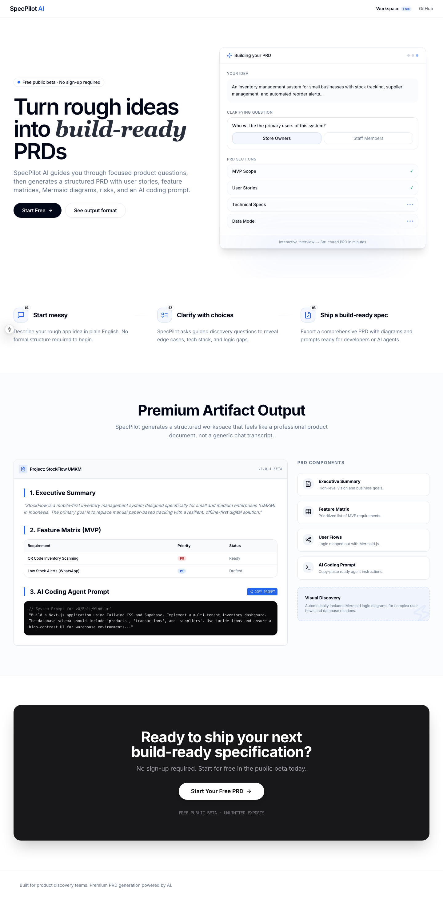
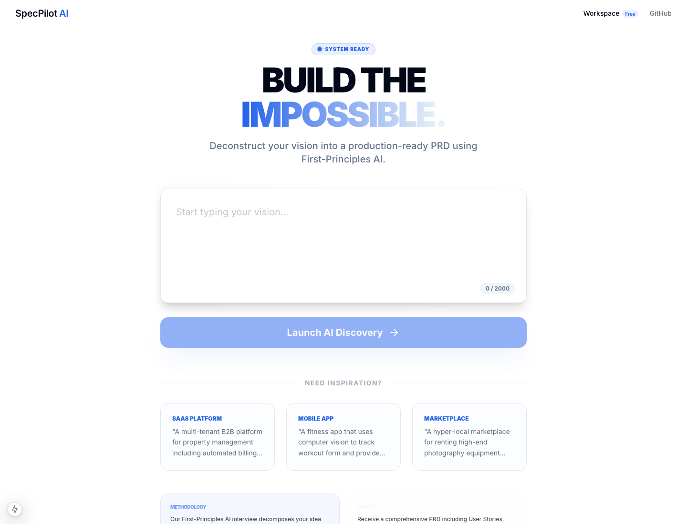
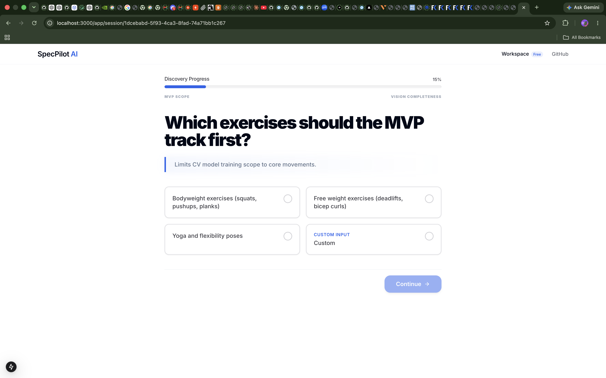

# SpecPilot AI

SpecPilot AI turns rough product ideas into execution-ready visual Markdown PRDs through a guided AI interview.


## Current Version

**v0.1.0 MVP**

This version includes the core idea input, output language preference (`id` or `en`, default `id`), guided interview flow, Markdown PRD generation, 9Router provider integration, and copy/download support.

## Status

SpecPilot AI is currently in MVP stage. The core flow is working, while provider selection, public sharing, and export formats are planned for future versions.

## Screenshots

### Homepage


### Idea Input


### Interview Flow



## Requirements

- Node.js 20+
- pnpm
- PostgreSQL database

## Install

```bash
pnpm install
```

## Environment Setup

Copy `.env.example` to `.env` and configure:

```bash
cp .env.example .env
```

Required environment variables:
- `DATABASE_URL`: PostgreSQL connection string
- `DIRECT_URL`: Direct PostgreSQL connection (for migrations)
- AI provider credentials (GROQ_API_KEY, OPENROUTER_API_KEY, or NINE_API_KEY)

## Run Development Server

```bash
pnpm dev
```

App runs at `http://localhost:3000`.

## Scripts

```bash
pnpm dev                    # Start development server
pnpm build                  # Build for production
pnpm start                  # Start production server
pnpm typecheck              # Run TypeScript type checking
pnpm lint                   # Run ESLint
pnpm seed:demo              # Seed database with demo session
pnpm capture:screenshots    # Capture app screenshots (requires dev server running)
```

## API Endpoints

- `GET /api/health`
- `POST /api/project/create`
- `POST /api/interview/question`
- `POST /api/interview/answer`
- `POST /api/prd/generate`
- `GET /api/prd/:session_id`

`POST /api/project/create` accepts `outputLanguage: "id" | "en"` as an optional field. Default is Bahasa Indonesia (`"id"`). This preference controls AI interview questions, answer options, and generated PRD language.

All request bodies are validated with Zod. Invalid requests return consistent JSON errors.

## Features

- **AI-Guided Interview**: Interactive Q&A flow to understand your product vision
- **Output Language Preference**: Choose Bahasa Indonesia (`id`, default) or English (`en`) before starting an interview
- **Visual PRD Generation**: Comprehensive PRDs with Mermaid diagrams, user stories, and technical architecture
- **Real-time Preview**: See your PRD build up as you answer questions
- **Multiple AI Providers**: Support for Groq, OpenRouter, and Nine AI
- **Local Database**: PostgreSQL storage with Prisma ORM
- **Modern UI**: Built with Next.js 15, React 19, and Tailwind CSS

## Tech Stack

- **Frontend**: Next.js 15, React 19, Tailwind CSS, Framer Motion
- **Backend**: Next.js API Routes, Prisma ORM
- **Database**: PostgreSQL
- **AI**: Vercel AI SDK with multiple provider support
- **Markdown Rendering**: react-markdown with Mermaid diagram support

## Deployment Notes

### Vercel Deployment

Prompt markdown files are included in Vercel serverless functions via Next.js output file tracing (`outputFileTracingIncludes` in `next.config.mjs`).

Runtime fallback prompts exist in `src/lib/prompts/fallback-prompts.ts` for production safety. If prompt files from `/docs` are unavailable at runtime, the system automatically falls back to embedded constants without crashing.

This ensures the application remains resilient in serverless environments where file system access may be limited.
